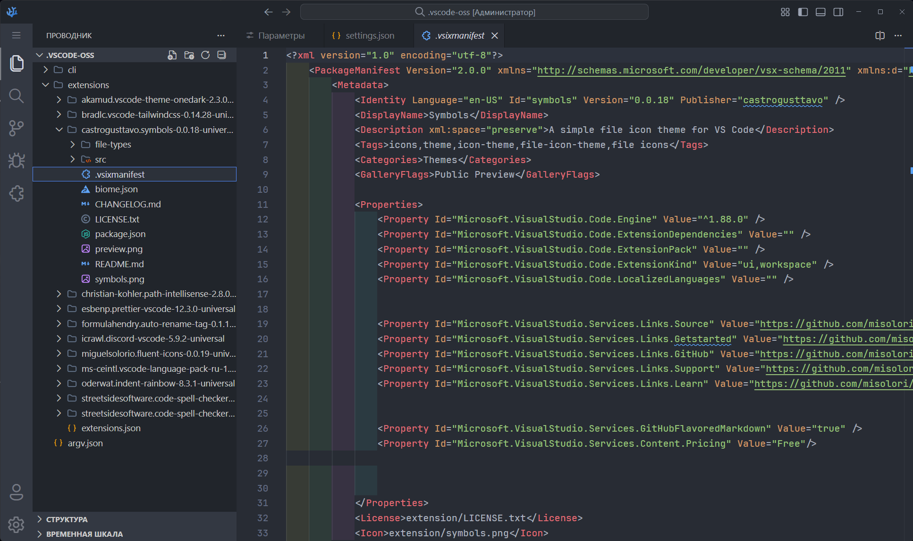

# VS Code Settings

Minimal and clean VS Code setup focused on readability and distraction-free coding.

## Preview

<p align="center">
 
</p>

## Requirements

- Visual Studio Code
- Font: [**JetBrains Mono**](https://www.jetbrains.com/lp/mono/)

## Included Extensions

- Atom One Dark Theme **(Theme)**
- Symbols **(Icons Pack)**
- Auto Rename Tag
- Code Spell Checker
- Discord Presence
- Fluent Icons
- indent-rainbow
- Path Intellisense
- Prettier – Code formatter
- Tailwind CSS IntelliSense

## Settings

```jsonc
{
    // Window
    "window.zoomLevel": 2,

    // Theme & Icons
    "workbench.colorTheme": "Atom One Dark",
    "workbench.iconTheme": "symbols",
    "workbench.productIconTheme": "fluent-icons",
    "symbols.hidesExplorerArrows": false,

    // Font
    "editor.fontFamily": "JetBrains Mono",
    "editor.fontSize": 14,
    "editor.lineHeight": 1.6,
    "editor.fontLigatures": true,

    // Cursor
    "editor.cursorBlinking": "expand",
    "editor.cursorSmoothCaretAnimation": "on",

    // Editor
    "editor.mouseWheelZoom": true,
    "editor.minimap.enabled": false,
    "breadcrumbs.enabled": false,

    // UI
    "workbench.statusBar.visible": false,
    "workbench.startupEditor": "none",
    "workbench.tips.enabled": false,

    // Explorer
    "workbench.tree.enableStickyScroll": false,
    "workbench.tree.renderIndentGuides": "none",
    "workbench.tree.indent": 20,
    "scm.compactFolders": false,
    "explorer.confirmDragAndDrop": false,
    "explorer.confirmDelete": false,

    // Decorations
    "search.decorations.badges": false,
    "git.decorations.enabled": false,
    "workbench.editor.decorations.colors": false,
    "workbench.editor.decorations.badges": false
}
```

## Install

1) Open VS Code
2) Open Settings (JSON)
3) Paste the settings
4) Restart VS Code
